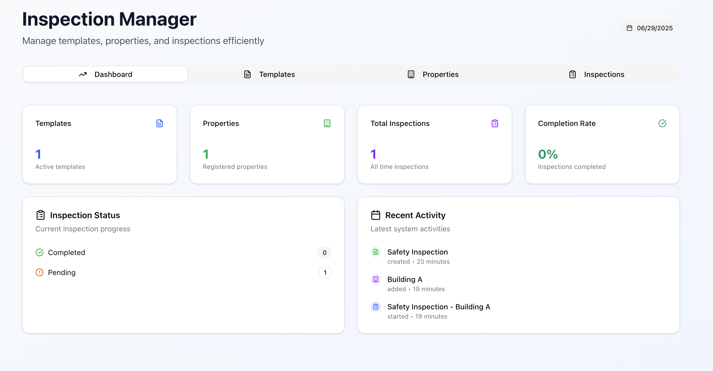
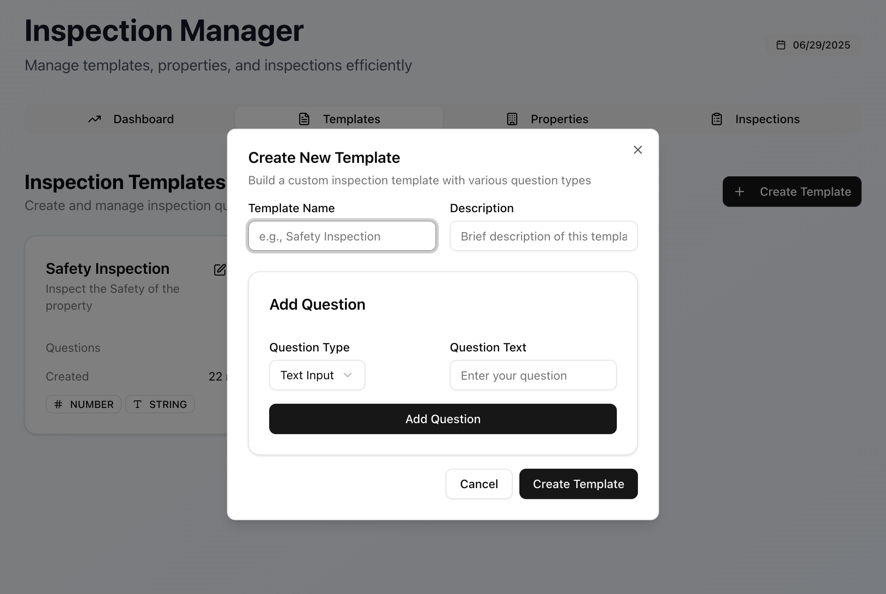
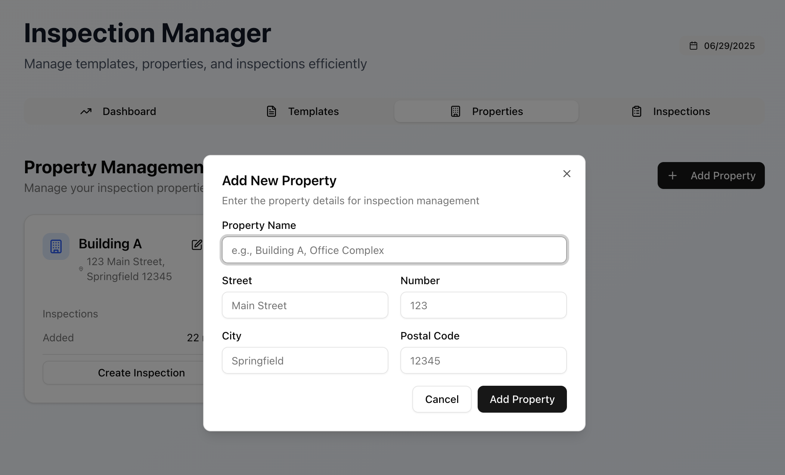
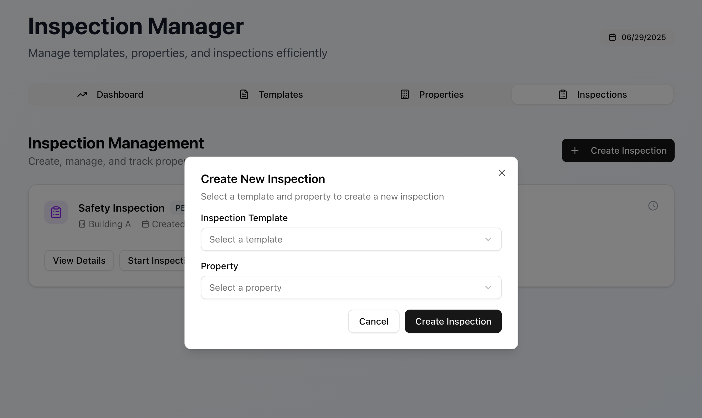

# Inspection App

This is a fullstack monorepo modern web UI for the Inspection App, built with **Node.js**, **Nest.js**, **MongoDB**, **React**, **Next.js**, **React Query**, and **ShadCN**. This frontend enables users to manage templates, properties, and inspections via a clean, responsive interface.

---

<p align="center">
    <a href="https://inspection-ui.vercel.app/" target="blank">UI Demo</a>
</p>






### Project Structure

```
/
├── apps/
│ ├── backend/ # NestJS + MongoDB API
│ └── frontend/ # Next.js + React Query + ShadCN UI
├── .gitignore
├── package.json
├── turbo.json
├── README.md # This file
└── ...
```

- **[api - NestJS app](/app/api)**: Node.js API built with NestJS and MongoDB.
- **[ui - Next.js app](/apps/ui)**: React UI built with Next.js, React Query, and ShadCN.
- **turbo.json**: TurboRepo pipeline configuration.

### Core Functional Features

- Template Management

  - Create, retrieve, and list inspection templates.

  - Templates support multiple question types: date input, string input, numeric input, single-choice, and multi-choice.

- Object (Property) Management

  - Create, retrieve, and list objects representing properties.

  - Each object includes fields for name and address (street, number, city, postal code).

- Inspection Management

  - Create inspections for specific objects using selected templates.

  - Fill out inspections by answering template-defined questions.

  - Retrieve and update inspections, including saving user responses.

### Technologies

#### Backend

- [Nest.js](https://nestjs.com/)
- [Nest Mongoose](https://www.npmjs.com/package/@nestjs/mongoose)
- [Swagger Documentation](https://www.npmjs.com/package/@nestjs/swagger)
- [Typescript v5](https://www.typescriptlang.org/)
- [Node.js](https://nodejs.org/)

#### Frontend

- [React JS](https://react.dev/)
- [Context API](https://react.dev/reference/react/createContext)
- [Shadcn](https://ui.shadcn.com/)
- [react-hook-form](https://react-hook-form.com/)
- [Zod Validation](https://zod.dev/)
- [Typescript](https://www.typescriptlang.org/)
- [Node.js](https://nodejs.org/)

### Getting Started

> Check out the readme for the sub folders [ui](/apps/ui/README.md) and [api](/apps/api/README.md) respectively.

#### Prerequisites

- [Node.js](https://nodejs.org/) (v18+ recommended)
- [Docker](https://www.docker.com/) & [Docker Compose](https://docs.docker.com/compose/)
- [npm](https://www.npmjs.com/)

#### Setup

Create a .env file using .env.example for both the [apps/api](/apps/api) and [apps/ui](/apps/ui) add the following environment variables

- [apps/ui](/apps/ui)

  ```
  #### API URL ENV VARS ###
  NEXT_PUBLIC_APP_API_URL=[YOUR_API_URL] #http://localhost:4000/api

  ```

- [apps/api](/apps/api)

  ```
  MONGODB_URI=[YOUR_MONGODB_URI] #http://localhost:27017/gcp
  MONGODB_URI_TEST=[YOUR_MONGODB_URI_FOR_TEST] #mongodb://localhost:27017/test_gcp
  API_PORT=[YOUR_PORT] #4000
  ```

### Install Dependencies

From the root directory:

`npm install`

#### Run All Apps in Development

In separate terminals, run:

##### Start the backend API (NestJS)

```
cd apps/api
npm run dev
```

##### Start the frontend UI (Next.js)

```
cd apps/ui
npm run dev
```

Or use Turbo to run both in parallel:

navigate to root folder and run

```
npm run dev
```

### Deployment

> This App is deployed to the vercel.app, please use this link to access the site [https://inspection-ui.vercel.app/](https://inspection-ui.vercel.app/)

### Author

Ravisankar Chinnam
