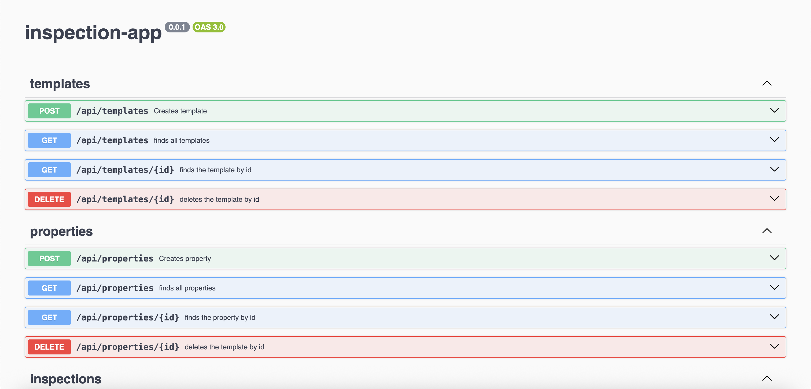

# Inspection App Backend

A Node.js REST API for managing inspection templates, properties, and inspections, built with **NestJS** and **MongoDB**. This backend powers the Inspection App, enabling CRUD operations and business logic for inspection workflows.

<p align="center">
    <a href="https://inspection-api-fk55.onrender.com/documentation" target="blank">API Demo</a>
</p>

<p align="center"></p>

---

### Features

- CRUD for **Templates** (with multiple question types: date, string, numeric, single-choice, multi-choice)
- CRUD for **Objects** (properties with address fields)
- CRUD for **Inspections** (create, fill, update, and retrieve inspections per property and template)
- RESTful API with input validation and error handling
- Modular, clean, and well-documented codebase
- Dockerized for easy deployment

### Tech Stack

- **Node.js** + **NestJS**
- **MongoDB** (Mongoose ODM)
- **Docker** & **Docker Compose**
- **Jest** for testing

### Getting Started

#### Prerequisites

- [Node.js](https://nodejs.org/) (v18+ recommended)
- [Docker](https://www.docker.com/) & [Docker Compose](https://docs.docker.com/compose/)

#### Local Development

##### Install dependencies

```npm install```

##### Build and run both API and MongoDB

```docker-compose up --build```

##### Run the app

```npm run dev```

The API will be available at `http://localhost:3000`.

### API Endpoints

| Resource     | Method | Endpoint                 | Description                        |
|--------------|--------|--------------------------|------------------------------------|
| Templates    | POST   | /templates               | Create a new template              |
|              | GET    | /templates               | List all templates                 |
|              | GET    | /templates/:id           | Get template details               |
| Properties      | POST   | /properties                 | Create a new property              |
|              | GET    | /properties                 | List all properties                |
|              | GET    | /properties/:id             | Get property details               |
| Inspections  | POST   | /inspections             | Create a new inspection            |
|              | GET    | /inspections             | List all inspections               |
|              | GET    | /inspections/:id         | Get inspection details             |
|              | PUT    | /inspections/:id         | Update inspection answers          |

### Testing

> Run unit and integration tests

```npm run test```

### Docker

- **Dockerfile** and **docker-compose.yml** are provided.
- To build and run with Docker:  
```docker-compose up --build```

### Enhancements

- Implement Role based authentication/authorization
- Implement APIs with GraphQL for advanced search with more filters
- Cursor Pagination can be implemented
- advanced business rules can be added as needed

### Author

> Ravisankar Chinnam